# 部署 Flare Stack Blog

通过 **GitHub + Cloudflare Workers Builds**，在浏览器中完成博客部署，并使用自己的域名访问和管理博客。

## 前置条件

- 一个 GitHub 账号。
- 一个 Cloudflare 账号，已经绑定付款方式并开通 R2。
- 一个已在 Cloudflare 托管、状态为 **Active（有效）** 的域名。

下文以 `blog.example.com` 为博客域名、`flare-blog` 为 Worker 名称，部署时替换成自己的值即可。建议使用空闲子域名，并在托管域名的 Cloudflare 账号下创建所有资源。

## 开始操作

1. [Fork 仓库](#1-fork-仓库)
2. [准备两份变量清单](#2-准备两份变量清单)
3. [创建 GitHub OAuth App](#3-创建-github-oauth-app)
4. [创建 Cloudflare 资源](#4-创建-cloudflare-资源)
5. [可选：开启图片优化](#5-可选开启图片优化)
6. [创建 Worker 并部署](#6-创建-worker-并部署)
7. [登录博客，成为管理员](#7-登录博客成为管理员)
8. [以后如何更新](#8-以后如何更新)

### 1. Fork 仓库

打开 [du2333/flare-stack-blog](https://github.com/du2333/flare-stack-blog)，点击右上角 **Fork**。

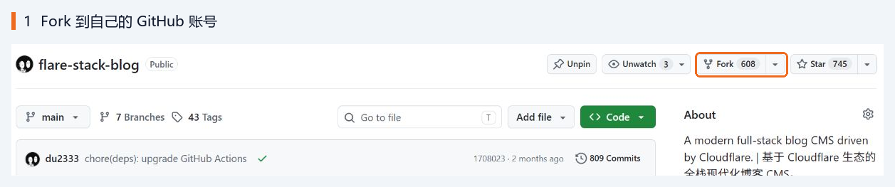

在创建页面中，Owner 选择自己的 GitHub 账号，仓库名保留 `flare-stack-blog`，勾选 **Copy the main branch only**，点击 **Create fork**。

创建后会进入 `github.com/你的用户名/flare-stack-blog`，后续使用这份仓库部署。

### 2. 准备两份变量清单

在 Fork 的仓库根目录中打开下面两个文件，点击 **Raw** 复制内容，分别保存到电脑上的两个文本文件中。也可以从下面的链接查看本项目模板：

| 项目模板 | 建议保存为 | 用途 | 最后填到哪里 |
| --- | --- | --- | --- |
| [.env.example](../.env.example) | `.env` | **构建时变量**：告诉部署程序使用哪个域名和哪些资源 | Cloudflare 的构建设置 |
| [.dev.vars.example](../.dev.vars.example) | `.dev.vars` | **运行时变量**：博客运行时使用的认证配置等 | Worker 的运行时变量与机密 |

将这两份清单保存在本地，随着后续步骤补齐变量，最后填入 Cloudflare。其中的密钥请妥善保管。

#### 构建时必填项

| 变量 | 示例 / 从哪里获取 | 作用 |
| --- | --- | --- |
| `WORKER_NAME` | `flare-blog` | Worker 应用名称，第 6 步的 Project name 必须与它一致 |
| `DOMAIN` | `blog.example.com` | 博客的纯域名 |
| `D1_DATABASE_ID` | 第 4 步复制的 Database ID / UUID | 找到存放文章、用户等数据的数据库 |
| `BUCKET_NAME` | `blog-media` | 找到存放图片等文件的 R2 存储桶 |
| `QUEUE_NAME` | `blog-queue` | 找到处理通知等异步任务的队列 |
| `KV_NAMESPACE_ID` | 第 4 步复制的 Namespace ID | 找到博客使用的缓存空间 |

构建清单保留上面六项，先填好 `WORKER_NAME` 和 `DOMAIN`，其余值在第 4 步补齐。模板中的可选项和本地工具变量可以跳过。

#### 运行时必填项

| 变量 | 应该填什么 | 作用 |
| --- | --- | --- |
| `BETTER_AUTH_SECRET` | 自己生成的一串随机密钥，至少 32 个字符 | 保护登录会话等认证数据；生成后妥善保存 |
| `BETTER_AUTH_URL` | `https://blog.example.com` | 博客完整访问地址，用于登录和回调 |
| `DOMAIN` | `blog.example.com` | 运行时使用的域名，与构建时一致 |
| `GITHUB_CLIENT_ID` | 第 3 步获取的 Client ID | 标识你的 GitHub 登录应用 |
| `GITHUB_CLIENT_SECRET` | 第 3 步获取的 Client Secret | GitHub 登录应用的密钥 |

将模板中的本地开发配置改为线上配置：

- `BETTER_AUTH_URL=http://localhost:3000` 改成自己的完整 HTTPS 地址。
- `ENVIRONMENT=dev` 改成 `ENVIRONMENT=prod`。

两份清单中的 `DOMAIN` 填相同的值，分别用于部署时绑定域名和博客运行时读取。

`BETTER_AUTH_SECRET` 可以用密码管理器生成 64 位随机字母数字。也可以在任意可信 HTTPS 页面打开浏览器开发者工具的 Console（控制台），执行下面这段代码，复制结果，不包含两边引号：

```js
Array.from(crypto.getRandomValues(new Uint8Array(32)), (n) =>
  n.toString(16).padStart(2, "0"),
).join("");
```

### 3. 创建 GitHub OAuth App

这个应用让你和读者能够通过 GitHub 登录博客。

打开 GitHub **Settings → Developer settings → OAuth Apps → New OAuth App**，也可以直接打开 [创建 OAuth App 页面](https://github.com/settings/applications/new)。

| 表单项 | 填写内容 |
| --- | --- |
| Application name | 自己的博客名称，例如 `Flare Stack Blog` |
| Homepage URL | `https://blog.example.com` |
| Application description | 可留空 |
| Redirect URI / Authorization callback URL | `https://blog.example.com/api/auth/callback/github` |

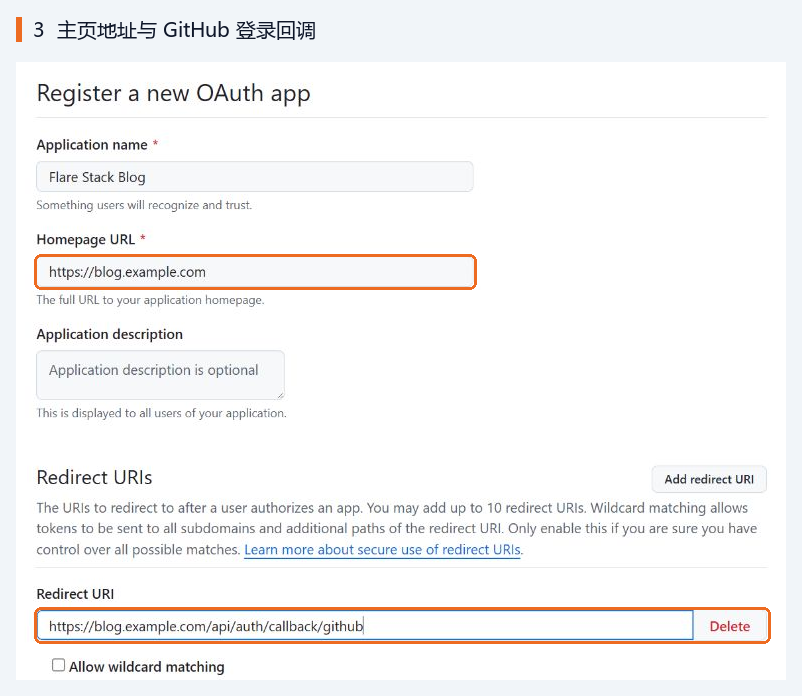

将示例域名换成自己的域名，回调地址末尾的 **`/api/auth/callback/github`** 保持不变，其余选项保留默认值。

点击 **Register application**。在应用详情页：

1. 复制 **Client ID**，填入运行时清单的 `GITHUB_CLIENT_ID`。
2. 点击 **Generate a new client secret**，按 GitHub 提示完成身份确认。
3. 立即复制新生成的 **Client secret**，填入 `GITHUB_CLIENT_SECRET`；离开页面后可能无法再次查看完整值。

### 4. 创建 Cloudflare 资源

打开 [Cloudflare 控制台](https://dash.cloudflare.com/)，选择托管域名的账号。下面四种资源各创建一个，名称可以自定。

| 资源 | 左侧菜单入口 | 示例名称 | 写入构建清单的内容 |
| --- | --- | --- | --- |
| D1 数据库 | Storage & databases → D1 SQLite Database | `blog-db` | **ID** → `D1_DATABASE_ID` |
| R2 存储桶 | Storage & databases → R2 Object Storage | `blog-media` | **名称** → `BUCKET_NAME` |
| Queue 队列 | Compute → Queues | `blog-queue` | **名称** → `QUEUE_NAME` |
| KV 命名空间 | Storage & databases → Workers KV | `blog-cache` | **ID** → `KV_NAMESPACE_ID` |

#### D1：存放文章和用户数据

进入 **D1 SQLite Database**，点击 **Create Database**，填写名称，例如 `blog-db`。位置选项保留默认，点击 **Create**。

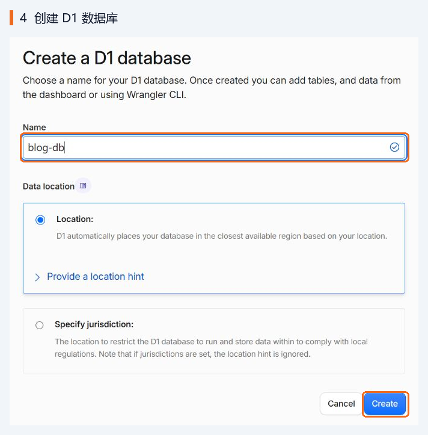

返回数据库列表，找到刚创建的数据库，在 **UUID** 一栏点击复制，将完整 ID 填入 `D1_DATABASE_ID`。也可以在数据库详情中查看 **Database ID**。

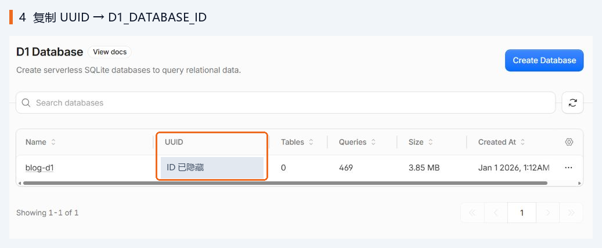

部署时会自动初始化数据库。

#### R2：存放图片等文件

进入 **R2 Object Storage**，点击 **Create bucket**，填写名称，例如 `blog-media`。Location 保留 **Automatic**，Default Storage Class 保留 **Standard**，点击页面底部的 **Create bucket**。

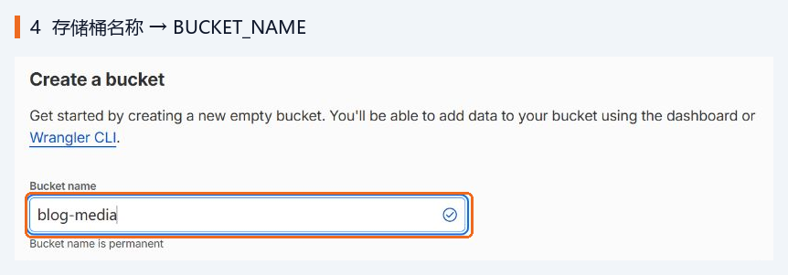

把存储桶**名称**填入 `BUCKET_NAME`，其余设置保留默认值。

#### Queue：处理通知等异步任务

进入 **Compute → Queues**，点击 **Create Queue**，填写名称，例如 `blog-queue`，再点击 **Create**。

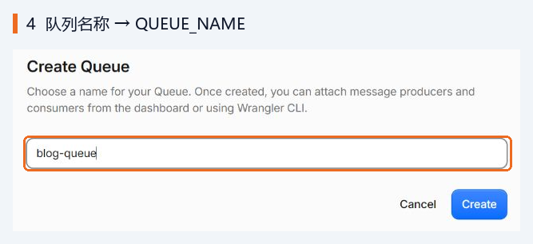

把队列**名称**填入 `QUEUE_NAME`。

#### KV：存放缓存

进入 **Storage & databases → Workers KV**，点击 **Create Instance**（部分界面显示 Create namespace），填写 Namespace name，例如 `blog-cache`，点击 **Create**。

返回列表，复制这一行 **ID** 列中的完整值，填入 `KV_NAMESPACE_ID`。

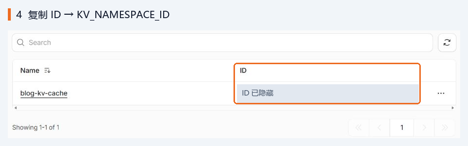

### 5. 可选：开启图片优化

开启 Cloudflare **Image Transformations（图片转换）** 后，博客会按需要对图片进行缩放和压缩。

在 Cloudflare 账号侧栏打开 **Images & Stream → Transformations**（部分界面位于 Images 下），找到博客所属的根域名，例如 `example.com`，为该域名启用转换。

进入域名的转换设置，Sources 选择 **This zone only**，允许本域名及其子域名作为图片来源，点击 **Save** 保存修改。

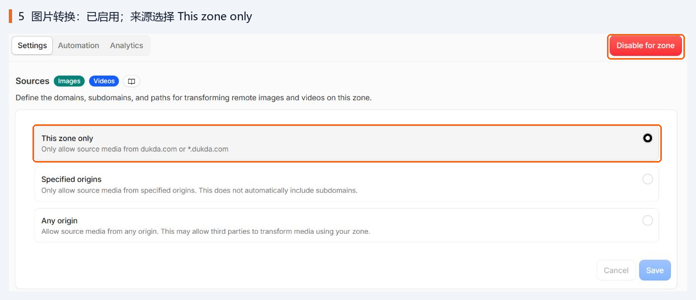

域名列表显示 **Enabled**，或设置页显示 **Disable for zone**，即表示已启用。跳过此步骤时，博客使用原图。转换额度及价格见 [Cloudflare Images 定价](https://developers.cloudflare.com/images/pricing/)。

### 6. 创建 Worker 并部署

#### 连接自己的 Fork

打开 **Compute → Workers & Pages → Create application**，选择 **Continue with GitHub**。

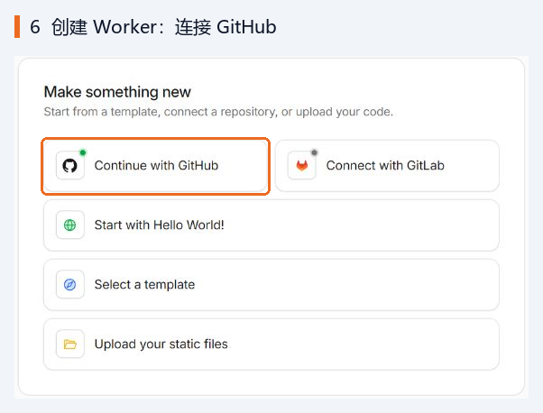

首次连接时，按页面提示授权 Cloudflare 访问你的 Fork 仓库。然后选择自己的 GitHub 账号，搜索 `flare-stack-blog`，选中仓库并点击 **Next**。

#### 填写构建设置

在 **Set up your application** 中，按下面填写：

| 设置项 | 填写内容 |
| --- | --- |
| Project name / Worker name | 与 `WORKER_NAME` 相同，例如 `flare-blog` |
| Build command | `bun run wrangler:prepare && bun run build` |
| Deploy command | `bun run deploy` |
| Path / Root directory | `/`，即仓库根目录 |
| Builds for non-production branches | 首次部署建议取消勾选 |

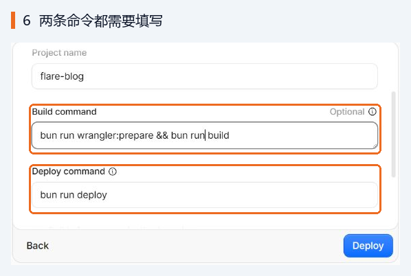

展开 **Advanced settings**，添加构建清单中的六个变量：**Variable name** 填等号左边的名称，**Variable value** 填等号右边的值，点击 **Add variable** 继续添加下一项。

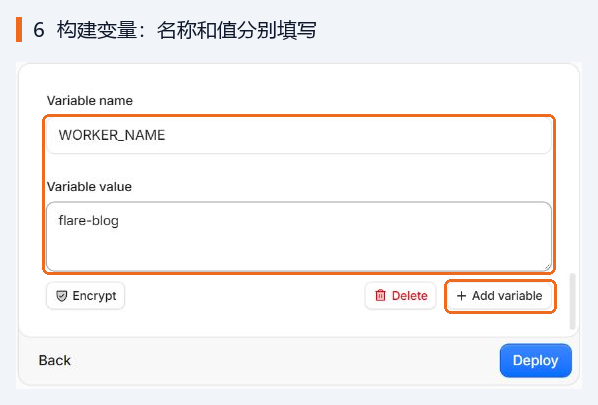

可在这里额外添加 `BUN_VERSION=1.3.5`，指定构建环境使用的 Bun 版本。

确认生产分支为 Fork 的 `main`。有些界面在创建时使用仓库默认分支，可在创建后的 **Settings → Builds → Branch control / Production branch** 中核对。后续自动部署监听的就是这个分支。

点击 **Deploy**，等待构建和部署成功。上述命令会自动完成资源绑定、数据库迁移和 Worker 发布，并通过 **Custom Domain（自定义域）** 绑定博客域名。

#### 添加运行时变量

第一次部署成功后，继续打开该 Worker 的 **Settings → Runtime variables and secrets**（部分界面显示 Variables and Secrets），点击 **Add variable**。

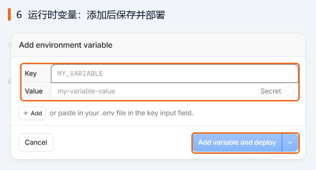

添加运行时清单中已填好的变量。可以逐项填写 Key / Value，也可以将 `KEY=value` 格式的变量行粘贴到 **Key** 输入框，批量导入。

- `BETTER_AUTH_SECRET`、`GITHUB_CLIENT_SECRET` 勾选 **Secret**，加密保存。
- `BETTER_AUTH_URL`、`DOMAIN`、`GITHUB_CLIENT_ID` 可使用普通文本。
- `ENVIRONMENT` 使用第 2 步设置的 `prod`。

点击 **Add variable and deploy**（保存并部署），等待变量生效。

最后在 Worker 的 **Domains**（部分界面为 Settings → Domains & Routes）中确认自己的域名已绑定；DNS 和证书生效后，通过 `https://blog.example.com` 访问。

### 7. 登录博客，成为管理员

打开自己的博客域名，点击右上角的登录入口，选择 **GitHub 登录**，完成 GitHub 授权。第一次登录会自动创建博客用户。

**新数据库中第一个创建的用户会自动成为管理员。** 配置好后先完成自己的首次登录，再把地址分享给别人。

登录后，点击右上角头像，应当能看到 **管理后台**；也可以直接访问 `https://blog.example.com/admin`。

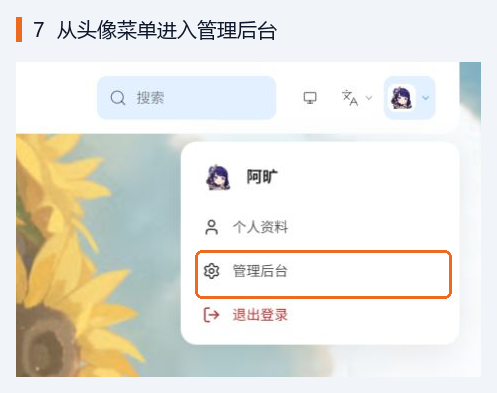

进入后台后，可以设置博客名称、介绍和外观，上传一张图片并发布第一篇文章。GitHub 登录不依赖邮件配置；邮箱注册、找回密码和通知邮件需要之后在后台配置邮件发送服务。

### 8. 以后如何更新

上游有新代码时，先阅读 [更新说明](https://github.com/du2333/flare-stack-blog/releases)，然后：

1. 打开**自己的 Fork 仓库**，切换到 Cloudflare 监听的生产分支，本文为 `main`。
2. 点击文件列表上方的 **Sync fork → Update branch**，将上游更新同步到自己的仓库。
3. 打开 Cloudflare 对应 Worker 的 **Deployments / Builds**，等待这次提交的构建和部署成功。
4. 刷新博客，检查首页和后台是否正常。

同步产生新提交后，Cloudflare Workers Builds 会自动部署，并执行数据库迁移，已有资源和运行时变量会保留。

若更新说明要求新增变量或调整配置，请一并完成。自行修改过代码的仓库，可能需要先解决同步冲突。

## 可选配置

先完成基本部署，再按需添加。所有变量的完整说明以 [.env.example](../.env.example) 和 [.dev.vars.example](../.dev.vars.example) 为准。

| 功能 | 构建时变量 | 运行时变量 | 补充说明 |
| --- | --- | --- | --- |
| Turnstile 人机验证 | `VITE_TURNSTILE_SITE_KEY` | `TURNSTILE_SECRET_KEY`（Secret） | 在 Cloudflare 创建站点并添加博客域名；Site Key 与 Secret Key 成对使用 |
| Umami 访问统计 | `VITE_UMAMI_WEBSITE_ID` | `UMAMI_WEBSITE_ID`、`UMAMI_SRC` | 两边 Website ID 填同一个，`UMAMI_SRC` 填服务地址，例如 `https://cloud.umami.is` |
| Umami 文章热度同步 | 同上 | Cloud 使用 `UMAMI_API_KEY`；自托管使用 `UMAMI_USERNAME`、`UMAMI_PASSWORD` | API Key 和密码设为 Secret；两种认证方式二选一。API 地址可按模板配置 `UMAMI_API_URL` |
| 减少后台更新检查的 GitHub API 限流 | 无 | `GITHUB_TOKEN`（Secret） | 按模板链接创建 Fine-grained token，权限保留默认的公共仓库只读访问 |

修改**构建时变量**后，需要重新触发构建，新值才会进入部署产物。修改**运行时变量**后，使用保存并部署使其生效。

## 常见问题

### 构建失败，提示缺少变量或找不到资源

打开失败记录的构建日志，先查看具体缺少哪一项，再检查 **Settings → Builds** 中的变量：

- 六个构建必填项是否齐全，名称是否拼写正确，值前后是否混入空格。
- D1 和 KV 填的是完整 **ID**，R2 和 Queue 填的是**名称**。
- Worker 和资源是否位于同一 Cloudflare 账号，`WORKER_NAME` 是否与应用名一致。
- Build command 是否包含 `bun run wrangler:prepare`，Deploy command 是否为 `bun run deploy`。

如果日志提示权限不足，检查 Builds 使用的 Cloudflare API token 是否有权部署 Worker、访问对应存储和队列资源、配置域名。构建授权说明见 [Workers Builds 配置文档](https://developers.cloudflare.com/workers/ci-cd/builds/configuration/)。修正后重新构建。

### 部署成功，但域名打不开或页面报错

检查域名是否已在同一账号托管并处于 Active，Worker 的 Domains 中是否出现该域名，DNS 和证书是否已生效。如果选的子域名已有其他 DNS 记录或绑定，先确认冲突来源，或换一个空闲子域名。

如果已经能访问 Worker 但页面报错，检查五个运行时必填项是否已保存并部署，并到 **Observability → Logs** 查看错误。

### GitHub 登录后提示回调地址错误，或回不到博客

逐项对照，下面三个值中的域名必须一致：

```text
博客访问地址：                 https://blog.example.com
BETTER_AUTH_URL：             https://blog.example.com
GitHub OAuth Redirect URI：   https://blog.example.com/api/auth/callback/github
```

同时确认 Client ID 和 Client Secret 来自同一个 OAuth App，运行时 `DOMAIN` 是纯域名，并通过配置的博客域名登录。

### 登录了，但没有管理员权限

管理员判断依据是数据库里的**第一个用户**。如果复用了已有用户的数据库，请使用原来的管理员账号登录。

### 同步了 Fork，但没有自动部署

检查更新是否进入 Cloudflare 监听的生产分支，以及 **Settings → Builds** 中的 GitHub 连接、生产分支和自动构建设置。如果配置了 Build watch paths，还要检查本次改动是否被排除。没有新提交，或仅同步到其他分支，都不会触发生产分支部署。

### 图片能显示，但没有优化效果

确认博客所属域名的 Transformations 已启用，Sources 允许博客域名及其子域名，并且转换额度可用。本地环境、GIF、原图请求不会转换，转换失败也会回退原图。应使用博客公开页面中请求了宽度或质量参数的图片检查效果。

---

[返回项目 README](../README.md)
